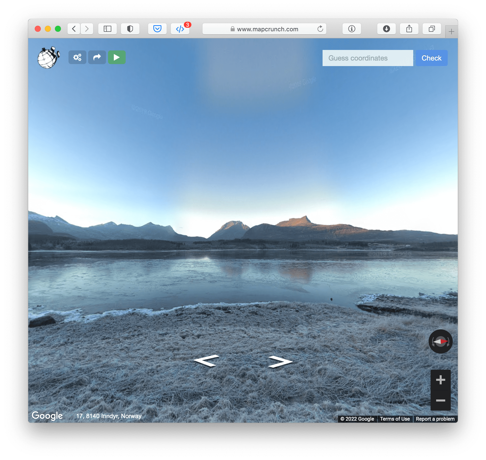
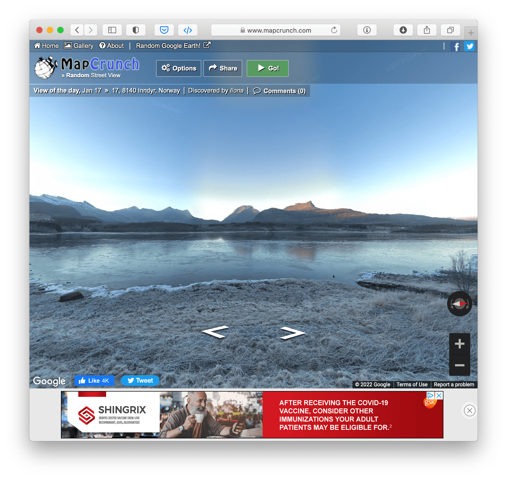

# MapCrunch userscripts

These scripts make it easier to play GeoGuessr-style games on mapcrunch.com:

- [Check your geo-guess](#check-your-geo-guess) adds an input box for (latitude, longitude) coordinates to MapCrunch, and a button which takes you to a Google Maps page showing directions from your MapCrunch starting point to those coordinates
- [Jump to map](#jump-to-map) adds two buttons to MapCrunch — the first opens Google Maps at your current location, and the second opens Maps to a set of directions from where you started out when you pressed "Go" to where you are now
- [Minimal UI](#minimal-ui) makes sure you can see as much of your streetview scene as possible, by hiding most of MapCrunch’s buttons and toolbars, and streamlining the few that remain (and it makes my other scripts look better, too)
- [Hide location names](#hide-location-names) hides the box with the name of the current location
- [Hide streetview labels](#hide-streetview-labels] hides the labels on roads, etc

I created and tested these using [Userscripts Safari](https://github.com/quoid/userscripts).

I use all of these together, but it should be possible to run any of them on its own.

## Check your geo-guess

This script adds an input box for map coordinates\* to MapCrunch, as well as a button to open a Google Maps page with directions to those coordinates from where you started out on MapCrunch after you pressed "Go."

\* Keyword searches will work too, but sometimes Google Maps will misinterpret your keyword (sometimes it tries to find a match that is closer to where you are connecting to the internet from) — so more specific keywords ("Halifax, Nova Scotia" instead of just "Halifax") are better, and explicit coordinates are best.

### How to use it

To play a GeoGuessr-style game, using explicit coordinates:

1. Open MapCrunch and load a random view
2. Guess where in the world that view is from
3. Open Google Maps in another tab
4. Using Google Maps, browse to the location that you have guessed
5. Right-click on the Google Map to bring up a menu with a set of (latitude, longitude) coordinates at the top
6. Click on the coordinates — this should automatically copy them to your device’s clipboard
7. Switch back to your MapCrunch tab
8. Paste the coordinates into the input field
9. Press “Guess”
10. Google Maps will open in a new tab, showing you directions from where you were on MapCrunch to the coordinates that you guessed

To play a GeoGuessr-style game, lazily, with keywords:

1. Open MapCrunch and load a random view
2. Guess where in the world that view is from
3. Type the name of a the city, and it's country ("Ankara, Turkey") or the name of a landmark ("Sukhothai Town") into the input box
4. Press "Guess"
5. Google Maps will open in a new tab, showing you directions from where you were on MapCrunch to the place that you guessed (hopefully)

### Screenshot

It looks like this (paired with [Minimal UI](#minimal-ui)):
 

## Jump to map

This script adds two buttons to MapCrunch:

1. "Map" opens Google Maps at your current location
2. "Directions from start" opens Google Maps to a set of directions from where you started out when you pressed "Go" to where you are now

## Minimal UI

This CSS stylesheet makes sure you can see as much of your streetview scene as possible by streamlining MapCrunch's UI. It also makes my other scripts look nicer.

The key features:

- streamlines the top bar
    - shrinks the logo and buttons
    - removes the translucent background
- moves the previous/next panorama buttons, and the location name, to the bottom left
- hides the "home, gallery, about..." bar at the top
- hides ads
- hides social media buttons
- adds CSS for the buttons from my other scripts

### Screenshots

With:

Without:

## Hide location names

Hides the box with the name of the current location

## Hide streetview labels

Hides the labels on roads, etc
